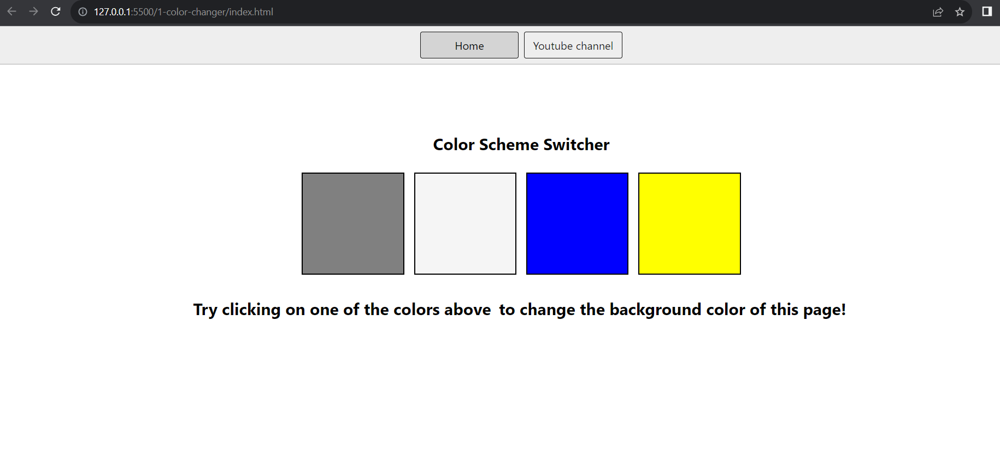
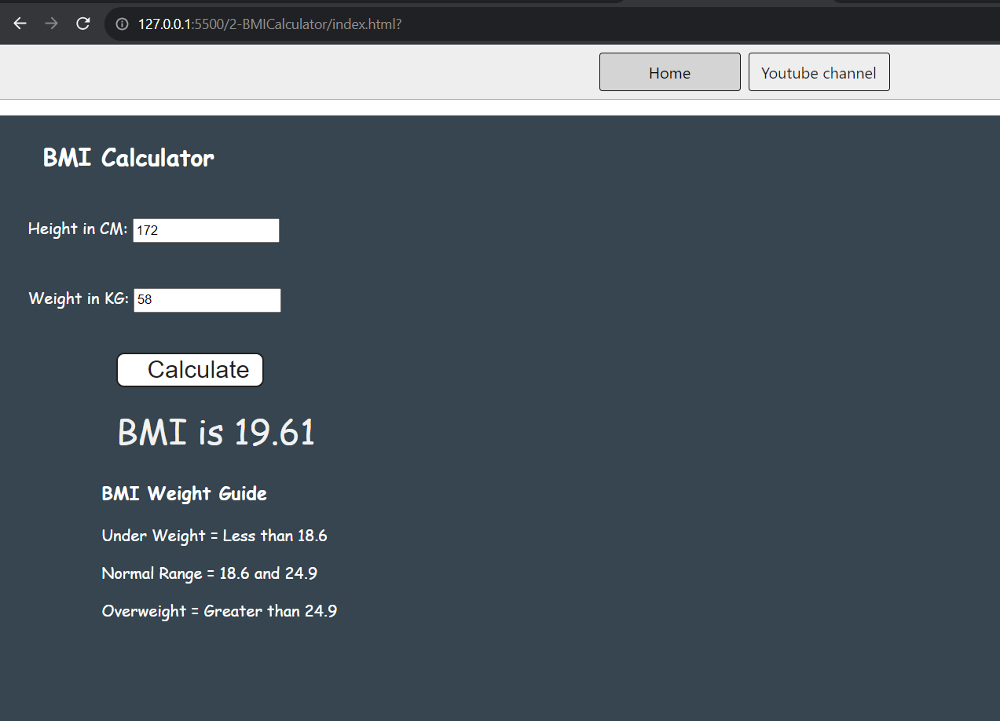
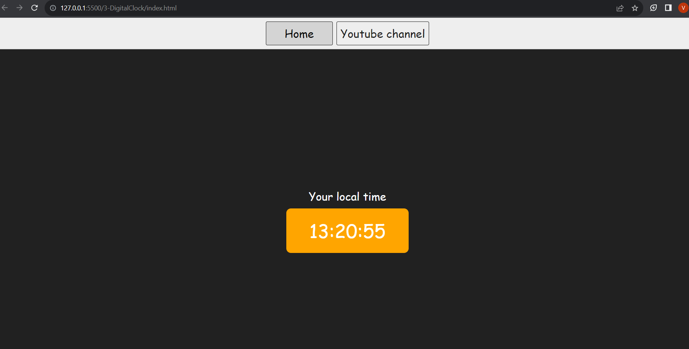
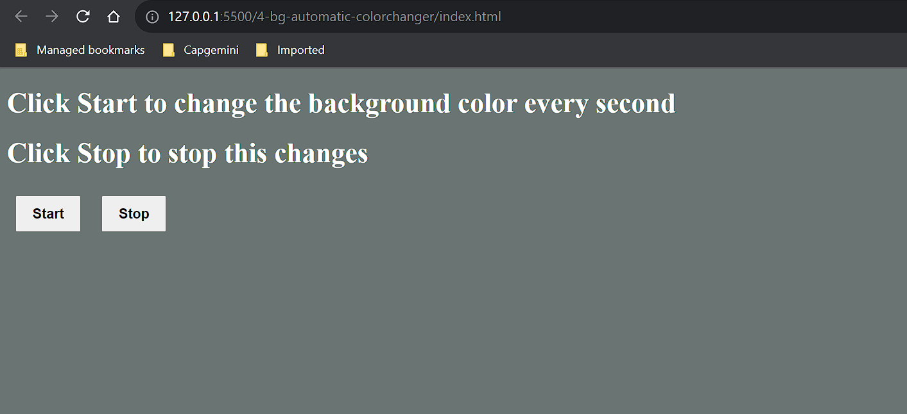
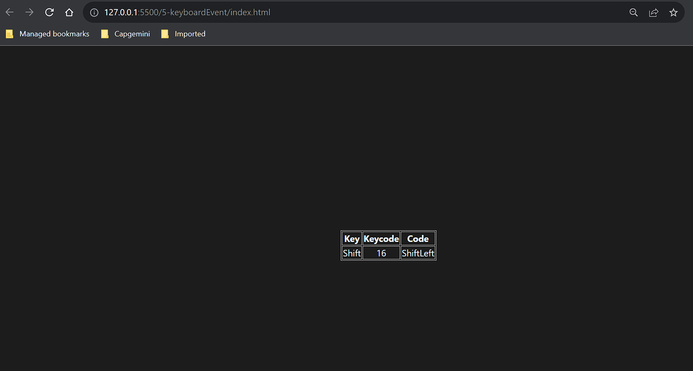

# javascript-projects

## 1. Color Changer

## Solution

```javascript
const buttons = document.querySelectorAll(".button");
const body = document.querySelector("body");

buttons.forEach((button) => {
  console.log(button);
  button.addEventListener("click", (e) => {
    console.log(e.target.id);
    switch (e.target.id) {
      case "white":
        body.style.backgroundColor = e.target.id;
        break;
      case "grey":
        body.style.backgroundColor = e.target.id;
        break;
      case "blue":
        body.style.backgroundColor = e.target.id;
        break;
      case "yellow":
        body.style.backgroundColor = e.target.id;
        break;
    }
  });
});
```



## 2. BMI Calculator

## Solution

```javascript
const form = document.querySelector("form");

form.addEventListener("submit", (event) => {
  event.preventDefault();

  const height = parseInt(document.querySelector("#height").value);
  const weight = parseInt(document.querySelector("#weight").value);
  const results = document.querySelector("#results");

  if (height === "" || height < 0 || isNaN(height)) {
    results.innerHTML = `${height} is not a valid height`;
  } else if (weight === "" || weight < 0 || isNaN(weight)) {
    results.innerHTML = `${weight} is not a valid weight`;
  } else {
    const bmi = (weight / ((height * height) / 10000)).toFixed(2);
    results.innerHTML = `<span>BMI is ${bmi}</span>`;
  }
});
```



## 3. Digital Clock

## Solution

```javascript
const clock = document.querySelector("#clock");

setInterval(() => {
  let date = new Date();
  clock.innerHTML = date.toLocaleTimeString();
}, 1000);
```



## 4. Automatic Background color changer (Events)

## Solution

```javascript
const randomHexColor = function () {
  const hex = "0123456789ABCDEF";
  let color = "#";
  for (let i = 0; i < 6; i++) {
    color += hex[Math.floor(Math.random() * 16)];
  }
  console.log(`color: ${color}`);
  return color;
};

let intervalId;
const startChangingColor = function () {
  if (!intervalId) {
    intervalId = setInterval(changeBgColor, 1000);
  }

  function changeBgColor() {
    document.body.style.backgroundColor = randomHexColor();
  }
};

const stopChangingColor = function () {
  clearInterval(intervalId);
  intervalId = null;
};

document.querySelector("#start").addEventListener("click", startChangingColor);

document.querySelector("#stop").addEventListener("click", stopChangingColor);
```



## 5. Capture Keyboard key event

## Solution

```javascript
const insert = document.querySelector("#insert");

window.addEventListener("keydown", (e) => {
  insert.innerHTML = `
        <div class="color">
            <table>
                <tr>
                    <th>Key</th>
                    <th>Keycode</th>
                    <th>Code</th>
                </tr>
                <tr>
                    <td>${e.key === " " ? "Space" : e.key}</td>
                    <td>${e.keyCode}</td>
                    <td>${e.code}</td>
                </tr>
            </table>
        </div> 
    `;
});
```


